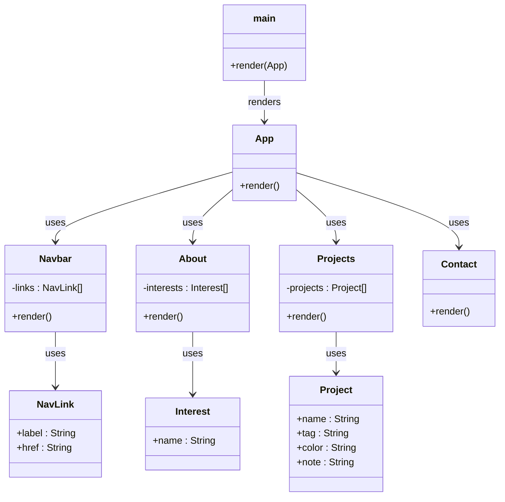

# Class Diagram: Keeia's Website

## How to read it

- `main` is main.jsx. It starts the app by rendering `App`.
- `App` is the parent. It shows the welcome card and the 4 components.
- `Navbar`, `About`, `Projects`, and `Contact` are the components you see on the page.
- `NavLink`, `Interest`, and `Project` are the 3 class models. They hold the data.
- The `[]` after a type means a list.
- The `+` means public and the `-` means private.
